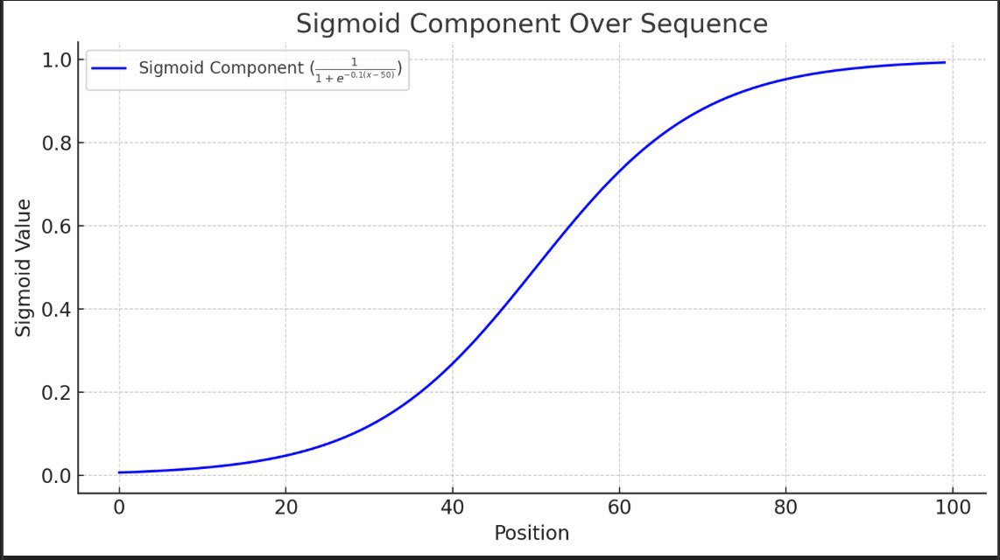
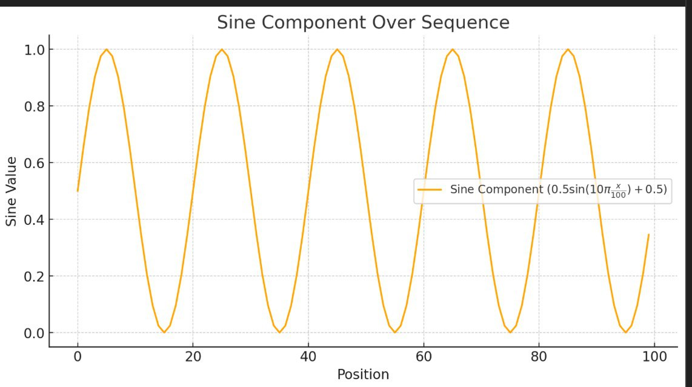
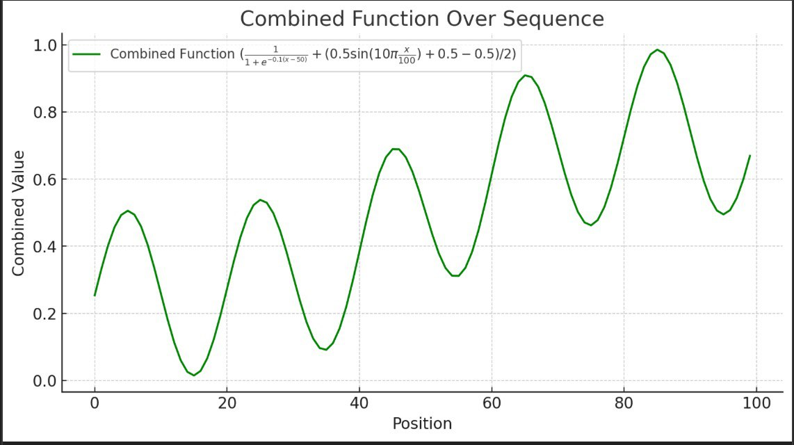

# QuestRewardGenerator

## Overview

Welcome to the `QuestRewardGenerator`! This class is designed to generate a mix of silver ('s') and bronze ('b') chests. Using a combination of mathematical functions, this generator creates a dynamic and unpredictable reward sequence for the quests. Additionally, it keeps consistent state, i.e. multiple exceution within the same or different app sassions will always return the same value/state for the given input.

## Features

- **Dynamic Reward Generation**: Create a sequence of rewards with varying probabilities.
- **Mathematical Precision**: Combines sigmoid and sine functions to determine reward probabilities, ensuring a balanced yet exciting distribution.

## How It Works

### Method Summary

#### `generateRewards(int n)`

This method generates a sequence of rewards for a given number of quests.

- **Parameters**:
  - `n`: Number of rewards to be generated.
- **Returns**:
  - A string of reward characters, where each character is either 's' (silver chest) or 'b' (bronze chest).

#### `predictState(int position, double relativePosition, double midpoint)`

Calculates the probability of a reward being a silver chest at a specific position.

- **Parameters**:
  - `position`: Position in the reward sequence.
  - `relativePosition`: Relative position in the range (0, 1] based on `position / n`.
  - `midpoint`: Midpoint of the rewards list, calculated as `n / 2`.
- **Returns**:
  - A probability value where <= 0.5 indicates a bronze chest ('b') and > 0.5 indicates a silver chest ('s').

### Example Usage

Here's a quick example of how you can use the `QuestRewardGenerator` to create a sequence of rewards for a range of quests:

```java
public static void main(String[] args) {
    // Generate and print reward sequences for quests ranging from 50 to 69
    for (int i = 50; i < 70; ++i) {
        String rewards = generateRewards(i);
        System.out.println(rewards);
    }
}
```

##

### How It All Comes Together

The reward generation process involves two key components: sigmoid and sine functions.

#### Sigmoid Component
This component creates a smooth transition in probabilities from 0 to 1, making the likelihood of getting a silver chest gradually increase as you move through the sequence.

Note: The sigmoid function is inherently a smoothly increasing function. Therefore, using it alone will not facilitate the back-and-forth transitions between 's' and 'b', which are essential characteristics of the reward generator.




#### Sine Component
To keep things interesting and allow back transition in between 'b' <-> 's', the sine component introduces multiple ups and downs in the probability, ensuring that the rewards alternate between 'b' and 's' in a wave-like pattern.




By combining these two components, the generator produces a well-balanced and engaging reward sequence.


